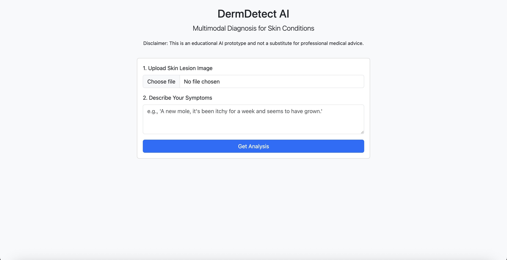

# Multimodal AI for Dermatological Diagnosis

This project presents a proof-of-concept multimodal diagnostic system that assists in identifying common skin conditions. It leverages both computer vision and natural language processing to analyze a dermatological image and patient-provided symptoms, respectively. The system then provides a predicted condition, a confidence score, and a helpful, context-aware recommendation generated by a large language model.

## Features

- **Multimodal Input**: Accepts both an image of a skin lesion and a text description of symptoms for a more holistic analysis.
- **AI-Powered Analysis**: Utilizes a deep learning model that fuses features from a state-of-the-art vision transformer (ResNet50) and a language model (BERT).
- **LLM-Generated Recommendations**: Integrates with the OpenRouter.ai API to provide dynamic, patient-friendly explanations and next steps for the predicted condition.
- **Web Interface**: A simple, user-friendly web interface built with Flask allows for easy interaction with the model.

## Demo

### Web Interface


### Upload and Analysis


### Results and Recommendations


## System Architecture

The core of this project is a multimodal neural network with a dual-stream architecture.

### Vision Component (CNN)

- An input image (resized to 224x224 pixels) is fed into a ResNet50 model, pre-trained on ImageNet.
- The final classification layers of ResNet50 are removed, and the model is used as a powerful feature extractor.
- The output is a 2048-dimensional feature vector that numerically represents the visual characteristics of the skin lesion.
- During training, the layers of the base ResNet50 are frozen to leverage the learned ImageNet features.

### Language Component (BERT)

- Patient-provided symptom text is processed by a BERT (Bidirectional Encoder Representations from Transformers) model (bert-base-uncased) from the Hugging Face library.
- BERT's advanced tokenizer converts the text into a format the model understands.
- The model generates contextual embeddings for the text. We use the final hidden state of the [CLS] token, which acts as an aggregate representation of the entire text.
- This results in a 768-dimensional feature vector.

### Fusion and Classification

- The 2048-dim image vector and the 768-dim text vector are combined using Late Fusion. They are concatenated to form a single, rich 2816-dimensional multimodal vector.
- This fused vector is passed through a small classification "head" consisting of Dense layers with ReLU activation and Dropout for regularization, before a final Softmax layer outputs a probability distribution across the 7 possible skin condition classes.

### Recommendation Engine (LLM via OpenRouter)

- The final predicted class from the model is sent to the OpenRouter.ai API.
- We use a powerful, free model like mistralai/mistral-7b-instruct to generate a helpful, safe, and informative recommendation. This makes the output dynamic and useful, rather than just a static label.

## Technology Stack

- **Backend**: Python, Flask
- **Deep Learning**: TensorFlow, Keras, Hugging Face Transformers
- **Data Manipulation**: Pandas, NumPy, Scikit-learn
- **Image Processing**: Pillow
- **LLM Provider**: OpenRouter.ai API
- **Dataset**: HAM10000 ("Human Against Machine with 10,000 Training Images")

## Setup and Installation

Follow these steps to set up and run the project locally.

### 1. Prerequisites

- Git
- Python 3.11 (This project was developed and tested with Python 3.11. Using other versions may cause dependency issues). You can install it with Homebrew on macOS: `brew install python@3.11`.
- An OpenRouter API Key.

### 2. Clone the Repository

```bash
git clone https://github.com/your-username/multimodal-derm-project.git
cd multimodal-derm-project
```

### 3. Set Up Virtual Environment

It is highly recommended to use a virtual environment.

```bash
# Create the virtual environment using Python 3.11
python3.11 -m venv venv

# Activate it
source venv/bin/activate
```

### 4. Install Dependencies

```bash
pip install -r requirements.txt
```

### 5. Download and Organize Data

The model is trained on the HAM10000 dataset.

1. Download the dataset from [Kaggle](https://www.kaggle.com) or the [Harvard Dataverse](https://dataverse.harvard.edu).
2. Create a `data` directory in the project root.
3. Inside `data`, place the `HAM10000_metadata.csv` file.
4. Inside `data`, create another directory named `images`.
5. Move all 10,000+ `.jpg` image files into the `data/images/` directory.

The final structure should be:

```
data/
├── HAM10000_metadata.csv
└── images/
    ├── ISIC_0024306.jpg
    └── ...
```

### 6. Set Up API Key

Open `app.py` and find the following line. Replace the placeholder with your OpenRouter API key.

```python
OPENROUTER_API_KEY = os.getenv("OPENROUTER_API_KEY", "YOUR_OPENROUTER_KEY_HERE")
```

## How to Run the Project

Execute the following commands from the root directory in your activated virtual environment.

### 1. Prepare the Data

This script will process the metadata, generate synthetic symptom text, and create `train.csv`, `val.csv`, and `test.csv`.

```bash
python3 prepare_data.py
```

### 2. Train the Model

This will build and train the multimodal model. It will save the trained model as `multimodal_derm_model.h5`. 

> **Note**: This is computationally intensive and will take a long time without a GPU.

```bash
python3 train_model.py
```

### 3. Run the Web Application

This starts the Flask development server.

```bash
python3 app.py
```

Once it's running, open your web browser and go to `http://127.0.0.1:5000` to use the application.

## Project Structure

```
├── app.py                  # Main Flask application
├── prepare_data.py         # Script to preprocess data
├── train_model.py          # Script to train the model
├── requirements.txt        # Python dependencies
├── templates/
│   └── index.html          # Frontend HTML
├── data/                   # (After setup) Contains data files
│   ├── HAM10000_metadata.csv
│   ├── images/
│   ├── train.csv
│   └── ...
├── multimodal_derm_model.h5 # (After training) The saved model
└── README.md
```

## License

This project is licensed under the MIT License. See the LICENSE file for details.

## Acknowledgments

- This project uses the HAM10000 dataset, collected by the University of Queensland and the Medical University of Vienna.
- The BERT model is provided by the Hugging Face team.
